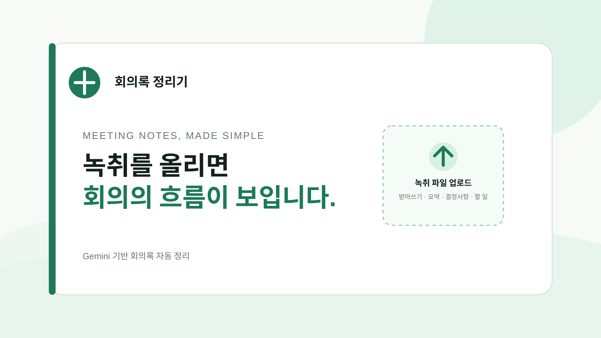

# 회의록 정리기



녹취 파일을 올리면 회의 내용을 받아쓰고, 핵심 요약·결정사항·할 일로 정리하는 웹 애플리케이션

## 주요 기능

- 오디오 파일 업로드
  - MP3
  - WAV
  - M4A
  - WebM (Web Media)
  - Ogg (Ogg container)
- 텍스트 파일 업로드
  - TXT
  - MD
- Gemini 기반 오디오 받아쓰기
- 핵심 요약 생성
- 결정사항 분리
- 할 일 분리
- 담당자·기한 추출
- 드래그 앤 드롭 업로드
- 파일 형식 검증
- 25MB 용량 제한
- 처리 상태 및 오류 표시

## 실행 환경

- Node.js 18 이상
- npm
- Gemini API 키

## 설치

```bash
npm install
```

## 환경변수 설정

프로젝트 루트에 `.env.local` 파일 생성

Google Gemini API (Application Programming Interface) 인증 정보 설정

`.env.example`을 `.env.local`로 복사한 뒤 실제 인증 키를 입력

```bash
cp .env.example .env.local
```

인증 키는 `.env.local`에만 보관하며 GitHub에 커밋하지 않을 것

## 개발 서버 실행

```bash
npm run dev
```

브라우저 접속 주소

```text
http://localhost:3000
```

## 프로덕션 빌드

```bash
npm run build
npm run start
```

## 사용 흐름

1. `파일 찾아보기` 선택 또는 녹취 파일 드래그 앤 드롭
2. `회의록 정리하기` 선택
3. 받아쓰기 결과 확인
4. 핵심 요약·결정사항·할 일 확인

## 프로젝트 구조

```text
app/
  api/process/route.ts  # 파일 업로드 및 Gemini 처리 API
  globals.css           # 애플리케이션 스타일
  layout.tsx            # 공통 레이아웃 및 메타데이터
  page.tsx              # 업로드 화면 및 결과 화면
lib/
  gemini.ts             # Gemini 요청 및 응답 스키마
public/
  meetingnote-thumbnail.svg  # README 대표 이미지
```

## API 처리 방식

- 브라우저 파일 업로드: `POST /api/process`
- 오디오: Gemini 인라인 데이터로 전달 후 받아쓰기 및 회의록 생성
- TXT·MD: 텍스트 본문 전달 후 회의록 생성
- Gemini API 키: 서버 환경변수에서만 참조

## 보안 및 개인정보

회의 녹취에는 개인정보와 민감한 업무 정보가 포함될 수 있으므로 운영 환경 적용 전 아래 항목 검토 필요

- Gemini API 데이터 보존 정책
- 업로드 파일 보존 기간
- 회의록 삭제 기능
- 사용자 인증 및 접근 제어
- 파일 크기·길이 제한
- 운영 로그 내 녹취 내용 노출 방지

## 기술 스택

- Next.js
- React
- TypeScript
- Google Generative AI SDK
- Gemini

## 저장소

[GitHub 저장소](https://github.com/87ryanlee/meetingnote-simple)
